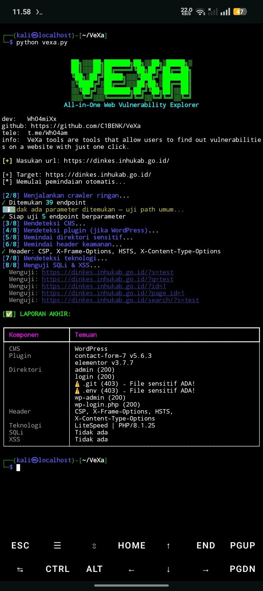

---

```md
# 🔍 VeXa  
**All-in-One Web Vulnerability Explorer**

> ⚠️ **For authorized security testing only. Do not use on systems you don't own or have explicit permission to test.**

---

## 💥 Automatic Scanning Features (Zero Configuration)
2. **Smart Crawler** — Discovers all internal URLs and parameters  
3. **CMS Detection** — Identifies WordPress, Joomla, Laravel + checks for outdated/known-vulnerable versions  
4. **Security Headers Audit** — Checks CSP, X-Frame-Options, HSTS, and more  
5. **SQL Injection Scan** — Silent integration with `sqlmap` (clean, user-friendly output)  
6. **XSS Detection** — Tests 10+ high-impact payloads  
7. **Sensitive Directory Brute-Force** — Hunts for `/admin`, `/.env`, `wp-login.php`, etc.  
8. **Final Report** — Clear, actionable summary for developers & pentesters

---

## 🚀 Quick Start
```bash
git clone https://github.com/yourname/VeXa.git
cd VeXa
pip install -r requirements.txt
python vexa.py
```

> Enter a target URL → Sit back → Get results.

Example:
```
[+] Enter URL: https://example.sch.id
```

---

## ⚙️ Requirements
- Python 3.7+
- Internet access

Install `sqlmap` (if missing):
```bash
sudo apt install sqlmap -y
# OR
git clone  https://github.com/sqlmapproject/sqlmap.git
```

---
- **If you find any bugs or anything like that, please contact me on tele**
---

##  Disclaimer
- **use this tool for legal activities**
- **THE CREATOR IS NOT RESPONSIBLE FOR WHAT THE USER DOES**

---

> Developer: C1BENK/Wh04amiXx
```

---

<p align="center">
  
</p>
